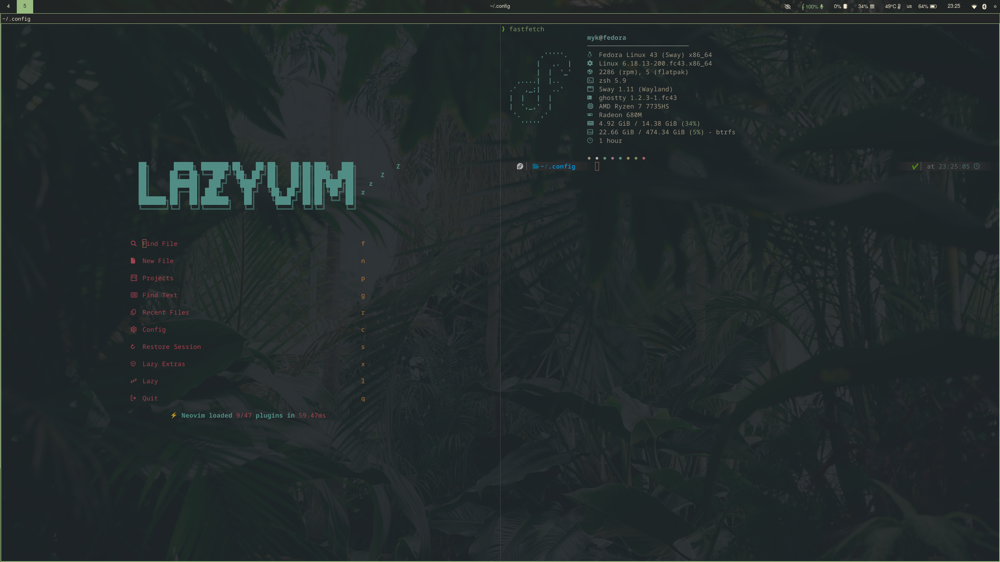
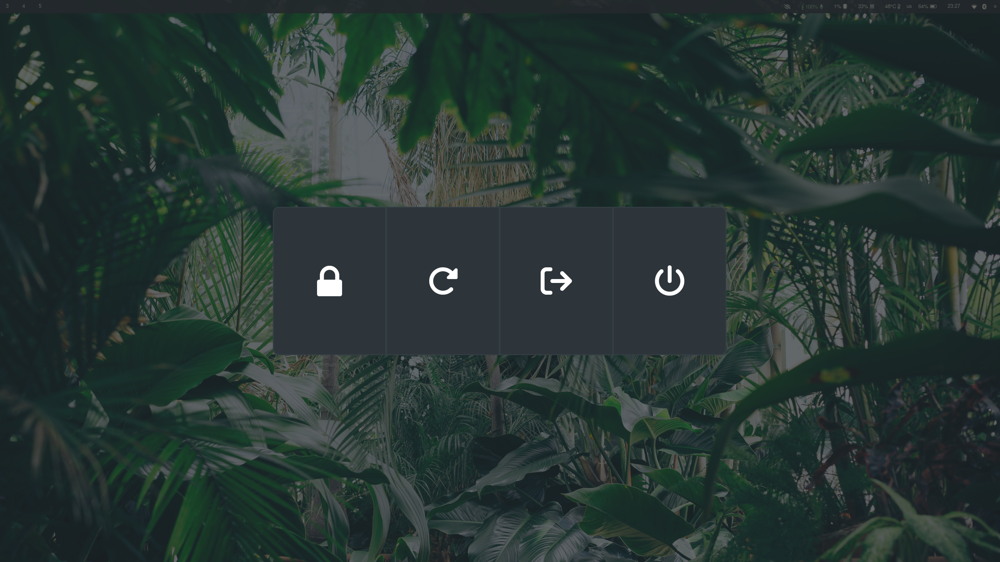

# 🎋 Bamboo Forest: Fedora Sway Setup


> A clean, organically styled Wayland environment built on Fedora Linux, featuring a custom Everforest/Bamboo aesthetic.

## 📸 Showcase

### The Desktop


### Development Environment


### Menus & Overlay
<p align="center">
  
  
</p>

## 🖥️ System Details

| Component | Choice |
| :--- | :--- |
| **OS** | Fedora Linux |
| **Window Manager** | Sway (Wayland) |
| **Status Bar** | Waybar |
| **Terminal** | Ghostty |
| **Editor** | Neovim (LazyVim) |
| **Application Launcher** | Rofi (Wayland fork) |
| **Power Menu** | wlogout |
| **Notifications** | Dunst |
| **Colour Theme** | Custom Bamboo / Everforest |

## 🎨 Colour Palette
This setup is built around a warm, custom earthy colour scheme designed to be harmonious and gentle on the eyes.

| Colour | Hex Code | Swatch |
| :--- | :--- | :--- |
| **Background** | `#252623` |  |
| **Foreground** | `#F1E9D2` |  |
| **Green** | `#8FB573` |  |
| **Yellow** | `#DBB651` |  |
| **Red** | `#E75A7C` |  |
| **Blue** | `#57A5E5` |  |
| **Magenta** | `#AAAAFF` |  |
| **Cyan** | `#70C2BE` |  |

## ⚙️ Installation
This repository is managed using a **bare Git repository**. There is no need for GNU Stow, symlinks, or moving files out of their native directories. 

**1. Clone the repository as a bare repo:**
```bash
git clone --bare [https://github.com/yourusername/dotfiles.git](https://github.com/yourusername/dotfiles.git) $HOME/.dotfiles
```

**2. Set up the temporary alias:**
```bash
alias dotfiles='/usr/bin/git --git-dir=$HOME/.dotfiles/ --work-tree=$HOME'
```

**3. Checkout the actual files to your home directory:**
```bash
dotfiles checkout
```
*(Note: If Git throws an error about overwriting existing files, simply back those up or remove them, then run the checkout command again).*

**4. Ignore untracked files to keep your Git status clean:**
```bash
dotfiles config --local status.showUntrackedFiles no
```

## ⌨️ Keybindings
A quick reference for navigating this environment:

| Keybind | Action |
| :--- | :--- |
| `Super + T` | Open Ghostty |
| `Super + D` | Open Rofi |
| `Super + Shift + Q` | Kill focused window |
| `Super + [1-9]` | Switch to workspace [1-9] |
| `Super + Shift + C` | Reload Sway configuration |

## 🤝 Acknowledgements
* [SwayWM](https://swaywm.org/) for the incredible Wayland compositor.
* [Sainnhe](https://github.com/sainnhe/everforest) for the original Everforest colour palette inspiration.
